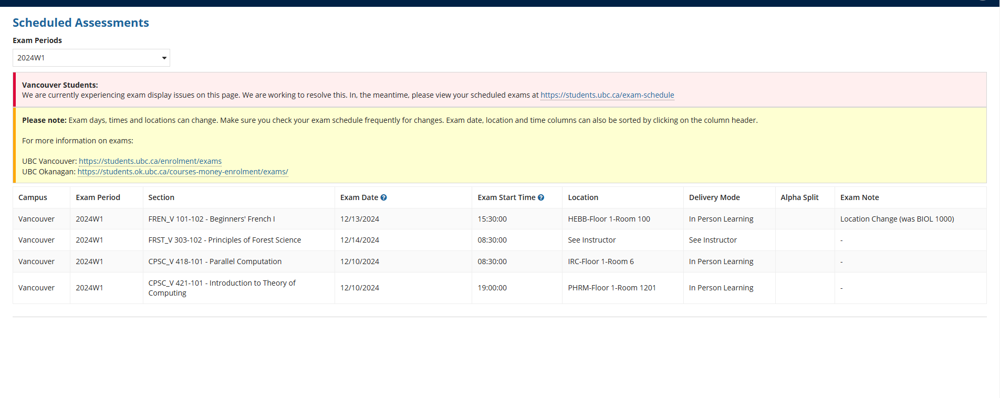

Welcome to my first post on this blog! I'm excited to start sharing my thoughts and experiences with you. Stay tuned for more updates and interesting content

This post is written on thanks giving dya, that marked myh almost ending my first half of final academic year life... I decided to move out of that shitty basement and it's such a good decision that makes me have much much more time and energy to focus on my important things...

I am working on microlight project, a system that makes AI has highest level of intelligence and execute on behalf of human for many tasks. This project will have a lot of phases consaier my current knowledge level and it's a long way to go . I will first implement most baisc functions and resource related programs fost. Include chapcha, emails , phone , patment verifications and many things like this,  ioI will just do these tedius work a little by little.

IN the mean while I iwlll keep trying my best in investing in the US equity market and other financial instrumentsl. I realized that my career  is kind of dea  and maybe the investmetn and quant trading can be my next direction. I w ill try myt best to explore the road for me.

I haven't wrote posts for a long time. I stop ding this when I decided to use 24 hours streaming with auto recording by youtube to replace the dailt note and reflection, because I ibelieve soon I will just use AI to generate a summary based on my everyday complete recordings about what I have done. This is truly interesting. (while I am typing this post my stream is still on!)

The finals are coming, dates are set. I am not really stressed about this term, because unlike previous academic years I have keep the pace most of the time and will just be fine to get above avg grades, but I may not be able to achieve a excellent grade I anticipated. The dates are:

Deep inside I may be disapointed by my current life. I am not sure if I can make it. But whining is truly useless, either kill youself or make it alive. 